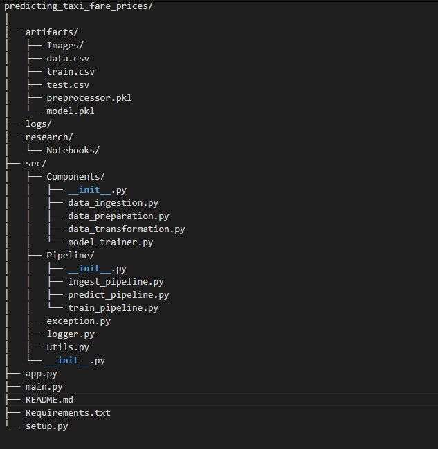

# Predicting Taxi Fare Prices
This repository implements a machine learning pipeline for predicting taxi fares using a modular approach. The project is divided into well-defined components focusing on specific tasks, promoting reusability, maintainability, and scalability.

## Key Features:

- Modular Design: The code is organized into modules for data ingestion, preparation, transformation, model training, and utilities.
- Data Pipelines: Components are chained together using pipelines for efficient data processing workflows.
- Taxi Fare Prediction: Predicts taxi fares based on historical data.


## Getting Started

- Prerequisites: Python (version 3.10 or above), libraries from requirements.txt
- Clone this repository.
- Run ```pip install -r requirements.txt``` to install dependencies.

## Running the Project:

- Prepare your data: Download the data from the website and upload to the data folder.
- Run the pipeline: Execute the script main.py to run the entire data processing and model training pipeline.

## Project Structure:
Here's the project Structure



Resources:
- [Medium Article](https://bit.ly/3QLKdoS)
